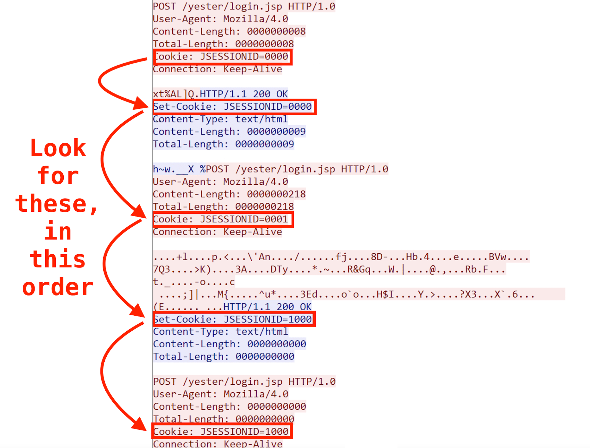

# Linux Malware C2 'RedXOR' - an example detection  
This package serves as a demonstration of how Zeek can be used to detect the Linux backdoor "redXOR" using state based methods.

References:
- [Corelight blog](https://corelight.blog/)
- https://www.intezer.com/blog/malware-analysis/new-linux-backdoor-redxor-likely-operated-by-chinese-nation-state-actor/  

Detecting threats at a lower level than traditional IOCs (eg C2 IPs, domains and uri) makes for a more robust detection. This is important, because any changes to these traditional factors (domain/IP/uri etc) are often and easily amended by the threat actor and this results in simple IOC based detections failing. Another benefit of using lower level behavioral detection logic (as provided in this package) is they are vastly less prone to False Positive detections. 

The logic of this detection algorithm involves looking for a very specific consecutive pattern of FIVE HTTP Cookies that are passed between the C2 and the implant as part of the negotiation between them. This then requires a stateful approach - which is perfectly suited to Zeek's event driven detection engine.

There are various other ways to detect this malware with Zeek. This script has been prepared as a tutorial style demonstration of one such technique, chosen as it highlights how Zeek's state keeping can be used a fairly intuitive and practical way to detect modern C2 malware.  
Credit to Intezer for their research on RedXOR, refer to this writeup for a low level description of the malware.
https://www.intezer.com/blog/malware-analysis/new-linux-backdoor-redxor-likely-operated-by-chinese-nation-state-actor/  

The script was prepared from an _abstraction_ of the actual pcap, which could not be shared in it's native format due to sensitive information contained within. This abstraction was prepared by Intezer Research team and shared with Corelight Labs for the purpose of writing this demonstration. 

The red markers on following diagram shows the state based detection logic employed by the script at a high level. Further to this, the [script](scripts/detect_redxor.zeek) itself is heavily commented, so to describe the reasons and the thinking behind some of the more technical aspects.

